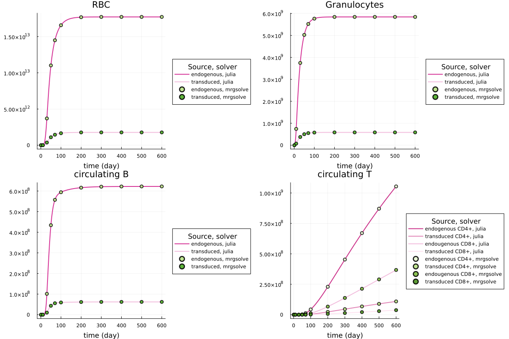

# About

This folder presents the implementation of the human stem cell differentiation model in Julia, and the verification.

# Julia setup 

Clone the entire repo to your local system, and then switch directory to the folder `julia`. All files should be in the same local folder and the above Julia packages should be installed and imported before running a simulation using the `ExVivo.jl` script.

Alternatively, you can use the provided `Project.toml` and `Manifest.toml` to create a static environment that is an exact snapshot of the environment we used to produce the outputs in this README.md file. For this, after running julia in the main root of this local folder, enter package `Pkg` environment and issue:

```julia
activate .
instantiate
```
And, then you can run a simulation using the `ExVivo.jl` script.

The running of this model requires Julia v1.7.

# Implementation verification

The verification was carried out by comparing simulated results between those from Julia and those from mrgsolve (in R). 

We focus on the 4 terminally differentiation cell types in the model: red blood cells (RBC), granulocytes, circulating B cells, and circulating T cells. We chose to focus on this because these were at the end of the differentiation. In addition, it was impossible to compare every level of progenitors in this system that contained 134 ODEs. 

The comparison was as follows. For all the cells we observed, simulation results from Julia and from mrgsolve were in perfect match. Thus, we consider the model's implementation in Julia matches the one in R. 



# Content

- `ExVivo.jl`. This is the implementation of the integrated model in Julia.

- JulisVerification.png. This is the verification based on RBC, granulocytes, circulating B cells and T cells. 

- `Manifect.toml` and `Project.toml`. Julia environment files. See setup notes. 

- rbc.csv. This is the data file generated from ```TestJulia.R``` for the purpose of comparing simulation results. 

- README.md. This README file. 

- `TestJulia.R`. This script was used to generate simulation result in R for comparison. 


